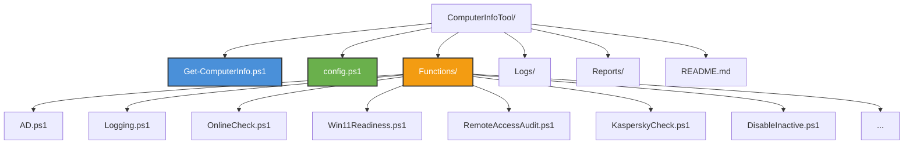

# 🖥️ ComputerInfoTool

> [!info] Описание
> Мощный модульный инструмент для аудита компьютеров в Active Directory.

---

## ✨ Возможности

| Возможность | Описание |
|-------------|----------|
| 📂 **Active Directory** | Получение информации из AD (ОС, OU, статус) |
| 🌐 **Доступность** | Проверка Ping + DNS + IP |
| 🪟 **Win11 Readiness** | Аудит готовности к Windows 11 (CPU, RAM, TPM 2.0, Secure Boot) |
| 🔌 **Удалённый доступ** | Поиск RDP-подключений и LiteManager |
| 🛡️ **Антивирус** | Проверка Kaspersky Endpoint / Security Center |
| 🚫 **Неактивные ПК** | Отключение и перемещение неактивных компьютеров |
| 🔍 **Дополнительно** | Проверка портов, файлов, установленного ПО |
| 📝 **Логирование** | Полноценное логирование |
| ⚡ **Масштабируемость** | Поддержка от 5 до 6000+ компьютеров |

---

## 📁 Структура проекта



| Файл / Папка | Назначение |
|--------------|------------|
| `Get-ComputerInfo.ps1` | ⭐ Главный скрипт |
| `config.ps1` | ⚙️ Конфигурация + функции ОС |
| `Functions/` | 📦 Модули функционала |
| `Logs/` | 📝 Логи выполнения |
| `Reports/` | 📊 Отчёты |
| `README.md` | 📖 Документация |

---

## 🚀 Примеры запуска

### 🔹 Базовый запуск

```powershell
.\Get-ComputerInfo.ps1 -ComputerListPath "computers.txt"
```

### 🔹 Полный аудит

> [!tip] Рекомендуется для комплексной проверки

```powershell
.\Get-ComputerInfo.ps1 -OU "OU=Workstations,DC=domine,DC=loc" `
    -IncludeOnlineCheck `
    -IncludeWin11Readiness `
    -IncludeRemoteAccessAudit `
    -IncludeKasperskyCheck `
    -IncludeLastLogon
```

### 🔹 Отключение неактивных компьютеров

> [!warning] Внимание!
> Перед выполнением рекомендуется использовать параметр `-WhatIf` для проверки!

```powershell
.\Get-ComputerInfo.ps1 -OU "OU=Computers,DC=domine,DC=loc" `
    -IncludeDisableInactive `
    -DaysInactive 45 `
    -TargetOU "OU=_Заблокированные1,DC=domine,DC=loc" `
    -WhatIf
```

---

## ⚙️ Основные параметры

| Параметр | Описание |
|----------|----------|
| `-ComputerListPath` | Путь к `txt`-файлу со списком компьютеров |
| `-OU` | OU для поиска в Active Directory |
| `-IncludeOnlineCheck` | Пинг + IP + DNS |
| `-IncludeWin11Readiness` | Полная проверка на Windows 11 |
| `-IncludeRemoteAccessAudit` | RDP + LiteManager |
| `-IncludeKasperskyCheck` | Поиск Kaspersky |
| `-IncludeDisableInactive` | Отключение старых ПК |
| `-LogLevel` | Уровень логирования: `Debug` / `Verbose` / `Info` / `Warning` |

---

## 🏷️ Теги

#powershell #active-directory #audit #windows11 #kaspersky #rdp #sysadmin #it-infrastructure

---

> [!quote] ComputerInfoTool — ваш надёжный помощник в аудите IT-инфраструктуры!
